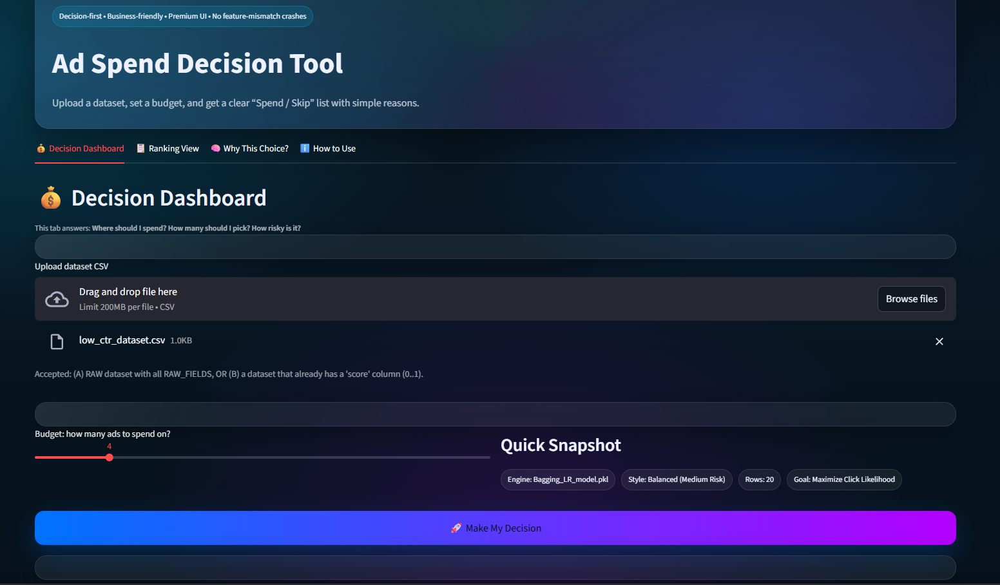
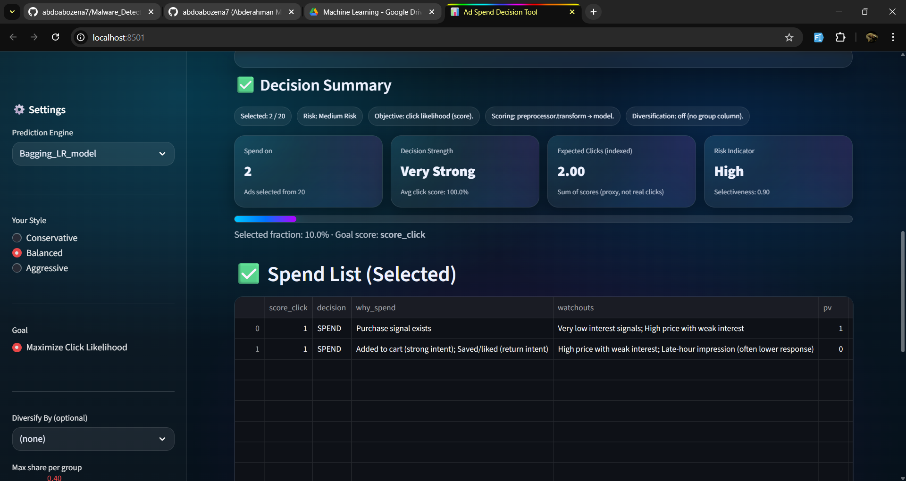
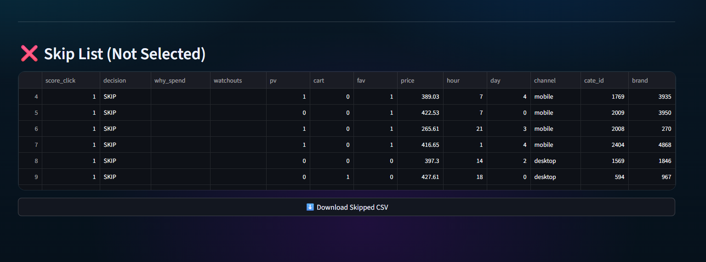
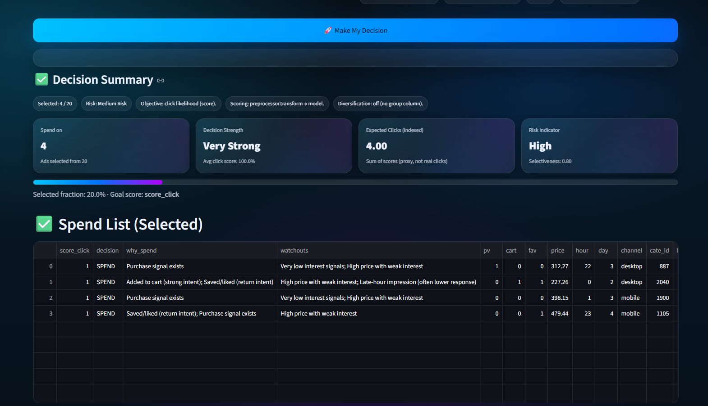

# Project Fusion ECU

AI-powered CTR prediction and ad spend decision support built with data fusion, ensemble learning, and a Streamlit interface.

## Overview

This project combines multiple advertising data sources to estimate click-through probability and support budget allocation decisions. It covers the full workflow from data preparation and feature engineering to model training, evaluation, and deployment.

The deployed interface is a Streamlit app that lets you:

- upload a CSV of ad opportunities
- score each row with trained CTR models
- rank opportunities by predicted click probability
- choose a Top-K spending budget
- export selected and skipped records

## Highlights

- Multi-source data fusion across user, ad, and behavior data
- Classical ML and ensemble models for tabular CTR prediction
- Notebook-based workflow for cleaning, EDA, preprocessing, training, and evaluation
- Streamlit decision console for interactive scoring and ranking
- Saved models and preprocessing artifacts included in the repository

## App Preview

The app in `app/streamlit_app.py` is designed as an "Ad Spend Decision Tool" with four main views:

- `Console`: upload data, score opportunities, and export spend decisions
- `Rank Lab`: inspect sorted predictions and score distribution
- `Explain One`: review one row with simple business-facing reasoning
- `How it Works`: quick operator guide for the decision flow

## Screenshots

<table>
  <tr>
    <td align="center" width="50%">
      
      <br>
      <sub>Main decision dashboard</sub>
    </td>
    <td align="center" width="50%">
      
      <br>
      <sub>Scored output and spend selection</sub>
    </td>
  </tr>
  <tr>
    <td align="center" width="50%">
      
      <br>
      <sub>Ranking and score inspection</sub>
    </td>
    <td align="center" width="50%">
      
      <br>
      <sub>Single-row explanation view</sub>
    </td>
  </tr>
</table>

## Repository Structure

```text
project_fusion_ecu/
|-- app/
|   `-- streamlit_app.py
|-- data/
|   |-- raw/
|   |   `-- v4_dataset/
|   `-- processed/
|-- models/
|-- notebooks/
|   |-- 01_data_overview.ipynb
|   |-- 02_data_cleaning.ipynb
|   |-- 03_eda_fusion.ipynb
|   |-- 04_preprocessing.ipynb
|   |-- 05_model_training.ipynb
|   |-- 06_model_evaluation.ipynb
|   `-- 07_deployment_streamlit.ipynb
|-- Screenshots/
|-- requirements.txt
`-- README.md
```

## Workflow

1. Inspect and understand the raw advertising datasets.
2. Clean and standardize source tables.
3. Fuse user, ad, and behavior information into a training dataset.
4. Engineer features and prepare model-ready inputs.
5. Train baseline and ensemble classifiers.
6. Compare models using ROC-AUC, PR-AUC, log loss, F1, and Precision@K.
7. Deploy the scoring experience through Streamlit.

## Models and Evaluation

The repository already includes trained models under `models/` and evaluation outputs under `data/processed/`.

### Best recorded results

| Model | ROC-AUC | PR-AUC | Log Loss | F1 |
| --- | ---: | ---: | ---: | ---: |
| Stacking_Calibrated | 0.5338 | 0.0983 | 0.8303 | 0.1612 |
| Bagging_LR | 0.5337 | 0.0976 | 0.5749 | 0.1554 |
| LogisticRegression | 0.5328 | 0.0975 | 0.6185 | 0.1561 |
| ExtraTrees | 0.5256 | 0.0955 | 0.2940 | 0.1551 |

Additional ranking performance from `precision_at_k.csv`:

- Best `Precision@500`: `Bagging_LR` at `0.140`
- Best `Precision@1000`: `ExtraTrees` at `0.127`
- Best `Precision@2000`: `RandomForest` at `0.1195`
- Best `Precision@5000`: `Stacking_Calibrated` at `0.102`

The current processed feature space uses `37` features according to `data/processed/feature_count.json`.

## Tech Stack

- Python
- Pandas and NumPy
- Scikit-learn
- XGBoost, LightGBM, and CatBoost
- Matplotlib, Seaborn, and Plotly
- Streamlit
- Jupyter notebooks

## Quick Start

### 1. Install dependencies

```bash
python -m venv .venv
.venv\Scripts\activate
pip install -r requirements.txt
```

### 2. Run the Streamlit app

```bash
streamlit run app/streamlit_app.py
```

### 3. Reproduce the notebook workflow

Run the notebooks in order:

1. `01_data_overview.ipynb`
2. `02_data_cleaning.ipynb`
3. `03_eda_fusion.ipynb`
4. `04_preprocessing.ipynb`
5. `05_model_training.ipynb`
6. `06_model_evaluation.ipynb`
7. `07_deployment_streamlit.ipynb`

## Notes

- The app expects trained models inside `models/`.
- The scoring flow uses `data/processed/preprocessor.joblib` when available.
- Processed artifacts and evaluation files already exist in this repository, so the app can be run directly if the environment is prepared.

## License

Add a license if you plan to publish or reuse the project outside coursework or internal use.
